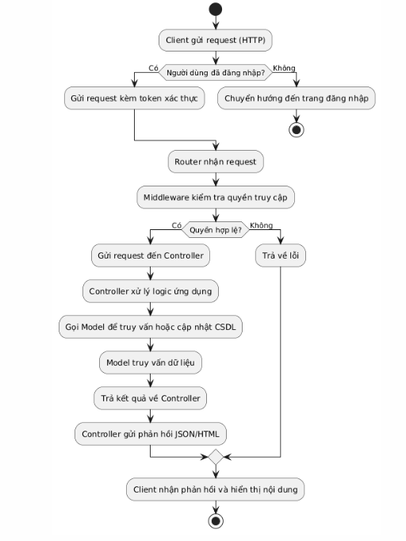
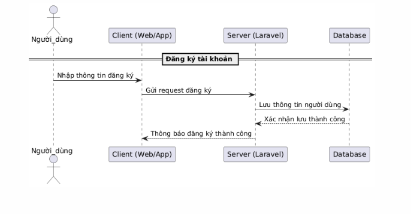
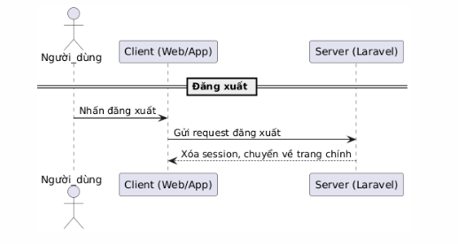
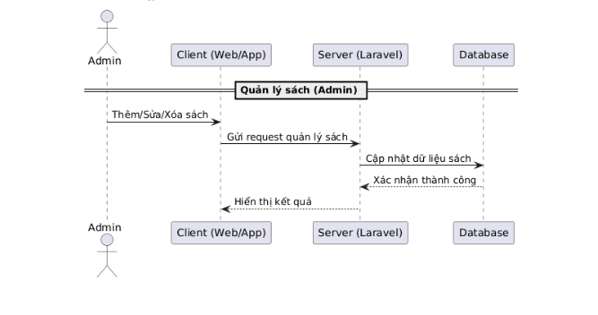
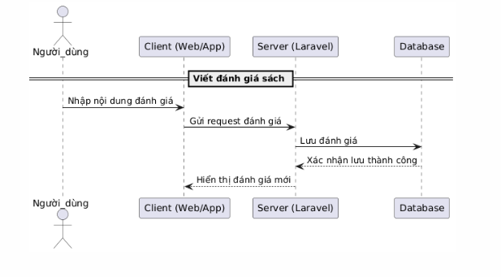
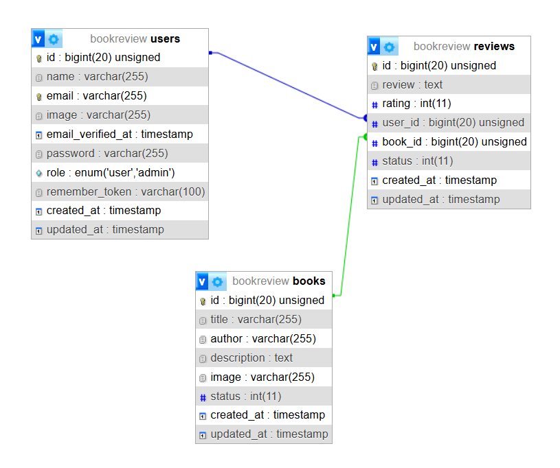

# Họ và tên: Nguyễn Sỹ Đồng
# Mssv: 22010021

# 📚 Web Giới Thiệu và Đánh Giá Sách

## 📖 Giới thiệu
Đây là một nền tảng giúp người dùng khám phá, đánh giá sách và chia sẻ nhận xét với cộng đồng. Người dùng có thể duyệt qua nhiều thể loại sách khác nhau, đọc mô tả chi tiết và xem đánh giá từ những người đọc khác.

## 🚀 Tính năng chính

### 🔹 **Người dùng**
- Xem danh sách sách theo mô tả, tác giả và các tiêu chí khác.
- Xem thông tin giới thiệu của từng cuốn sách.
- Đánh giá sách bằng cách để lại nhận xét và xếp hạng sao.
- Cập nhật hồ sơ cá nhân (profile).
- Đăng xuất khỏi hệ thống.

### 🔸 **Admin**
- Thêm, chỉnh sửa hoặc xóa sách trong danh mục.
- Quản lý đánh giá và bình luận của người dùng.
- Cập nhật hồ sơ cá nhân của admin.
- Đăng xuất khỏi hệ thống.

### 🔧 Yêu cầu hệ thống
- PHP >= 8.2
- Composer
- Laravel >= 11

## 🔑 Quyền truy cập
- **Người dùng**: Xem sách, đánh giá, cập nhật profile.
- **Admin**: Quản lý sách, đánh giá, bình luận, cập nhật profile.

## 📌 Sơ đồ cấu trúc/chức năng

### 1. Các thành phần chính:
- **HomeController**: Quản lý trang chủ và thông tin sách.
- **AccountController**: Quản lý tài khoản người dùng (đăng ký, đăng nhập, hồ sơ, đổi mật khẩu).
- **BookController**: Quản lý sách (CRUD, chỉ dành cho admin).
- **ReviewController**: Quản lý đánh giá sách (CRUD, chỉ dành cho admin và người dùng đã đăng nhập).

### 2. Phân quyền:
- **Khách (guest)**:
  - Truy cập trang chủ, xem chi tiết sách.
  - Đăng ký và đăng nhập.
- **Người dùng đã đăng nhập (auth)**:
  - Xem, cập nhật hồ sơ cá nhân.
  - Đăng xuất.
  - Đổi mật khẩu.
  - Quản lý đánh giá của chính mình.
- **Admin (check-admin middleware)**:
  - Quản lý sách (tạo, chỉnh sửa, xóa).
  - Quản lý tất cả đánh giá.

## Sơ đồ hoạt động hoặc flowchart để minh họa quá trình xử lý request từ client đến server
-
## 📌 Sơ đồ tuần tự
- **Đăng ký tài khoản**:
-
- **Đăng nhập tài khoản**:
-
- **Đăng xuất**:
-
- **Quản lý sách**:
-
- **Viết đánh giá sách**:
-

## 📌 Cơ sở dữ liệu
-

## 📌 Liên hệ
Nếu có bất kỳ vấn đề nào, vui lòng liên hệ qua email **nguyensydong21112004@gmail.com**

##github:  https://github.com/nguyensydong2004/mid-final

